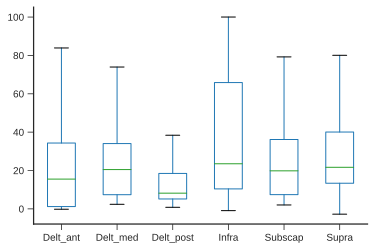

<p align="center">
  <a href="https://github.com/romainmartinez/pyomeca/actions"
    ></a>
  <a href="https://coveralls.io/github/romainmartinez/pyomeca?branch=master"
    ></a>
  <a href="https://anaconda.org/conda-forge/pyomeca"
    ></a>
  <a href="https://anaconda.org/conda-forge/pyomeca"
    ></a>
  <a href="https://anaconda.org/conda-forge/pyomeca"
    ></a>
  <a href="https://github.com/psf/black"
    ></a>
</p>

Pyomeca is a python library allowing you to carry out a complete biomechanical analysis; in a simple, logical and concise way.

## Pyomeca documentation

See Pyomeca's [documentation site](https://romainmartinez.github.io/pyomeca).

## Example

Pyomeca implements specialized functionalities commonly used in biomechanics. As an example, let's process the electromyographic data contained in this [`c3d file`](https://github.com/romainmartinez/pyomeca/blob/master/tests/data/markers_analogs.c3d).

You can follow along without installing anything by using our binder server: [](https://mybinder.org/v2/gh/romainmartinez/pyomeca/master)

```python
from pyomeca import Analogs

data_path = "../tests/data/markers_analogs.c3d"
muscles = [
    "Delt_ant",
    "Delt_med",
    "Delt_post",
    "Supra",
    "Infra",
    "Subscap",
]
emg = Analogs.from_c3d(data_path, suffix_delimiter=".", usecols=muscles)
emg.plot(x="time", col="channel", col_wrap=3)
```


```python
emg_processed = (
    emg.meca.band_pass(freq=emg.rate, order=2, cutoff=[10, 425])
    .meca.center()
    .meca.abs()
    .meca.low_pass(freq=emg.rate, order=4, cutoff=5)
    .meca.normalize()
)

emg_processed.plot(x="time", col="channel", col_wrap=3)
```


```python
import matplotlib.pyplot as plt

fig, axes = plt.subplots(ncols=2, figsize=(10, 4))

emg_processed.mean("channel").plot(ax=axes[0])
axes[0].set_title("Mean EMG activation")

emg_processed.plot.hist(ax=axes[1], bins=50)
axes[1].set_title("EMG activation distribution")
```


By converting the data array to a pandas dataframe, we can further extend the possibilities:

```python
emg_dataframe = emg_processed.meca.to_wide_dataframe()
emg_dataframe.plot.box(showfliers=False)
```



```python
emg_dataframe.corr().style.background_gradient().format("{:.2}")
```

<pre class="nb-output"><code><style  type="text/css" >
    #T_31df40b6_7f2d_11ea_945d_9cb6d0d1e6f9row0_col0 {
            background-color:  #023858;
            color:  #f1f1f1;
        }    #T_31df40b6_7f2d_11ea_945d_9cb6d0d1e6f9row0_col1 {
            background-color:  #e9e5f1;
            color:  #000000;
        }    #T_31df40b6_7f2d_11ea_945d_9cb6d0d1e6f9row0_col2 {
            background-color:  #fff7fb;
            color:  #000000;
        }    #T_31df40b6_7f2d_11ea_945d_9cb6d0d1e6f9row0_col3 {
            background-color:  #b5c4df;
            color:  #000000;
        }    #T_31df40b6_7f2d_11ea_945d_9cb6d0d1e6f9row0_col4 {
            background-color:  #fff7fb;
            color:  #000000;
        }    #T_31df40b6_7f2d_11ea_945d_9cb6d0d1e6f9row0_col5 {
            background-color:  #fff7fb;
            color:  #000000;
        }    #T_31df40b6_7f2d_11ea_945d_9cb6d0d1e6f9row1_col0 {
            background-color:  #308cbe;
            color:  #000000;
        }    #T_31df40b6_7f2d_11ea_945d_9cb6d0d1e6f9row1_col1 {
            background-color:  #023858;
            color:  #f1f1f1;
        }    #T_31df40b6_7f2d_11ea_945d_9cb6d0d1e6f9row1_col2 {
            background-color:  #3790c0;
            color:  #000000;
        }    #T_31df40b6_7f2d_11ea_945d_9cb6d0d1e6f9row1_col3 {
            background-color:  #b5c4df;
            color:  #000000;
        }    #T_31df40b6_7f2d_11ea_945d_9cb6d0d1e6f9row1_col4 {
            background-color:  #9ebad9;
            color:  #000000;
        }    #T_31df40b6_7f2d_11ea_945d_9cb6d0d1e6f9row1_col5 {
            background-color:  #0872b1;
            color:  #f1f1f1;
        }    #T_31df40b6_7f2d_11ea_945d_9cb6d0d1e6f9row2_col0 {
            background-color:  #fff7fb;
            color:  #000000;
        }    #T_31df40b6_7f2d_11ea_945d_9cb6d0d1e6f9row2_col1 {
            background-color:  #efe9f3;
            color:  #000000;
        }    #T_31df40b6_7f2d_11ea_945d_9cb6d0d1e6f9row2_col2 {
            background-color:  #023858;
            color:  #f1f1f1;
        }    #T_31df40b6_7f2d_11ea_945d_9cb6d0d1e6f9row2_col3 {
            background-color:  #fcf4fa;
            color:  #000000;
        }    #T_31df40b6_7f2d_11ea_945d_9cb6d0d1e6f9row2_col4 {
            background-color:  #e2dfee;
            color:  #000000;
        }    #T_31df40b6_7f2d_11ea_945d_9cb6d0d1e6f9row2_col5 {
            background-color:  #3f93c2;
            color:  #000000;
        }    #T_31df40b6_7f2d_11ea_945d_9cb6d0d1e6f9row3_col0 {
            background-color:  #4c99c5;
            color:  #000000;
        }    #T_31df40b6_7f2d_11ea_945d_9cb6d0d1e6f9row3_col1 {
            background-color:  #fff7fb;
            color:  #000000;
        }    #T_31df40b6_7f2d_11ea_945d_9cb6d0d1e6f9row3_col2 {
            background-color:  #a1bbda;
            color:  #000000;
        }    #T_31df40b6_7f2d_11ea_945d_9cb6d0d1e6f9row3_col3 {
            background-color:  #023858;
            color:  #f1f1f1;
        }    #T_31df40b6_7f2d_11ea_945d_9cb6d0d1e6f9row3_col4 {
            background-color:  #faf2f8;
            color:  #000000;
        }    #T_31df40b6_7f2d_11ea_945d_9cb6d0d1e6f9row3_col5 {
            background-color:  #a7bddb;
            color:  #000000;
        }    #T_31df40b6_7f2d_11ea_945d_9cb6d0d1e6f9row4_col0 {
            background-color:  #afc1dd;
            color:  #000000;
        }    #T_31df40b6_7f2d_11ea_945d_9cb6d0d1e6f9row4_col1 {
            background-color:  #f5eff6;
            color:  #000000;
        }    #T_31df40b6_7f2d_11ea_945d_9cb6d0d1e6f9row4_col2 {
            background-color:  #84b0d3;
            color:  #000000;
        }    #T_31df40b6_7f2d_11ea_945d_9cb6d0d1e6f9row4_col3 {
            background-color:  #fff7fb;
            color:  #000000;
        }    #T_31df40b6_7f2d_11ea_945d_9cb6d0d1e6f9row4_col4 {
            background-color:  #023858;
            color:  #f1f1f1;
        }    #T_31df40b6_7f2d_11ea_945d_9cb6d0d1e6f9row4_col5 {
            background-color:  #88b1d4;
            color:  #000000;
        }    #T_31df40b6_7f2d_11ea_945d_9cb6d0d1e6f9row5_col0 {
            background-color:  #abbfdc;
            color:  #000000;
        }    #T_31df40b6_7f2d_11ea_945d_9cb6d0d1e6f9row5_col1 {
            background-color:  #4094c3;
            color:  #000000;
        }    #T_31df40b6_7f2d_11ea_945d_9cb6d0d1e6f9row5_col2 {
            background-color:  #0570b0;
            color:  #f1f1f1;
        }    #T_31df40b6_7f2d_11ea_945d_9cb6d0d1e6f9row5_col3 {
            background-color:  #abbfdc;
            color:  #000000;
        }    #T_31df40b6_7f2d_11ea_945d_9cb6d0d1e6f9row5_col4 {
            background-color:  #83afd3;
            color:  #000000;
        }    #T_31df40b6_7f2d_11ea_945d_9cb6d0d1e6f9row5_col5 {
            background-color:  #023858;
            color:  #f1f1f1;
        }</style><table id="T_31df40b6_7f2d_11ea_945d_9cb6d0d1e6f9" ><thead>    <tr>        <th class="index_name level0" >channel</th>        <th class="col_heading level0 col0" >Delt_ant</th>        <th class="col_heading level0 col1" >Delt_med</th>        <th class="col_heading level0 col2" >Delt_post</th>        <th class="col_heading level0 col3" >Infra</th>        <th class="col_heading level0 col4" >Subscap</th>        <th class="col_heading level0 col5" >Supra</th>    </tr>    <tr>        <th class="index_name level0" >channel</th>        <th class="blank" ></th>        <th class="blank" ></th>        <th class="blank" ></th>        <th class="blank" ></th>        <th class="blank" ></th>        <th class="blank" ></th>    </tr></thead><tbody>

                <tr>
                        <th id="T_31df40b6_7f2d_11ea_945d_9cb6d0d1e6f9level0_row0" class="row_heading level0 row0" >Delt_ant</th>
                        <td id="T_31df40b6_7f2d_11ea_945d_9cb6d0d1e6f9row0_col0" class="data row0 col0" >1.0</td>
                        <td id="T_31df40b6_7f2d_11ea_945d_9cb6d0d1e6f9row0_col1" class="data row0 col1" >0.78</td>
                        <td id="T_31df40b6_7f2d_11ea_945d_9cb6d0d1e6f9row0_col2" class="data row0 col2" >0.38</td>
                        <td id="T_31df40b6_7f2d_11ea_945d_9cb6d0d1e6f9row0_col3" class="data row0 col3" >0.74</td>
                        <td id="T_31df40b6_7f2d_11ea_945d_9cb6d0d1e6f9row0_col4" class="data row0 col4" >0.6</td>
                        <td id="T_31df40b6_7f2d_11ea_945d_9cb6d0d1e6f9row0_col5" class="data row0 col5" >0.6</td>
            </tr>
            <tr>
                        <th id="T_31df40b6_7f2d_11ea_945d_9cb6d0d1e6f9level0_row1" class="row_heading level0 row1" >Delt_med</th>
                        <td id="T_31df40b6_7f2d_11ea_945d_9cb6d0d1e6f9row1_col0" class="data row1 col0" >0.78</td>
                        <td id="T_31df40b6_7f2d_11ea_945d_9cb6d0d1e6f9row1_col1" class="data row1 col1" >1.0</td>
                        <td id="T_31df40b6_7f2d_11ea_945d_9cb6d0d1e6f9row1_col2" class="data row1 col2" >0.77</td>
                        <td id="T_31df40b6_7f2d_11ea_945d_9cb6d0d1e6f9row1_col3" class="data row1 col3" >0.74</td>
                        <td id="T_31df40b6_7f2d_11ea_945d_9cb6d0d1e6f9row1_col4" class="data row1 col4" >0.76</td>
                        <td id="T_31df40b6_7f2d_11ea_945d_9cb6d0d1e6f9row1_col5" class="data row1 col5" >0.9</td>
            </tr>
            <tr>
                        <th id="T_31df40b6_7f2d_11ea_945d_9cb6d0d1e6f9level0_row2" class="row_heading level0 row2" >Delt_post</th>
                        <td id="T_31df40b6_7f2d_11ea_945d_9cb6d0d1e6f9row2_col0" class="data row2 col0" >0.38</td>
                        <td id="T_31df40b6_7f2d_11ea_945d_9cb6d0d1e6f9row2_col1" class="data row2 col1" >0.77</td>
                        <td id="T_31df40b6_7f2d_11ea_945d_9cb6d0d1e6f9row2_col2" class="data row2 col2" >1.0</td>
                        <td id="T_31df40b6_7f2d_11ea_945d_9cb6d0d1e6f9row2_col3" class="data row2 col3" >0.62</td>
                        <td id="T_31df40b6_7f2d_11ea_945d_9cb6d0d1e6f9row2_col4" class="data row2 col4" >0.67</td>
                        <td id="T_31df40b6_7f2d_11ea_945d_9cb6d0d1e6f9row2_col5" class="data row2 col5" >0.84</td>
            </tr>
            <tr>
                        <th id="T_31df40b6_7f2d_11ea_945d_9cb6d0d1e6f9level0_row3" class="row_heading level0 row3" >Infra</th>
                        <td id="T_31df40b6_7f2d_11ea_945d_9cb6d0d1e6f9row3_col0" class="data row3 col0" >0.74</td>
                        <td id="T_31df40b6_7f2d_11ea_945d_9cb6d0d1e6f9row3_col1" class="data row3 col1" >0.74</td>
                        <td id="T_31df40b6_7f2d_11ea_945d_9cb6d0d1e6f9row3_col2" class="data row3 col2" >0.62</td>
                        <td id="T_31df40b6_7f2d_11ea_945d_9cb6d0d1e6f9row3_col3" class="data row3 col3" >1.0</td>
                        <td id="T_31df40b6_7f2d_11ea_945d_9cb6d0d1e6f9row3_col4" class="data row3 col4" >0.61</td>
                        <td id="T_31df40b6_7f2d_11ea_945d_9cb6d0d1e6f9row3_col5" class="data row3 col5" >0.75</td>
            </tr>
            <tr>
                        <th id="T_31df40b6_7f2d_11ea_945d_9cb6d0d1e6f9level0_row4" class="row_heading level0 row4" >Subscap</th>
                        <td id="T_31df40b6_7f2d_11ea_945d_9cb6d0d1e6f9row4_col0" class="data row4 col0" >0.6</td>
                        <td id="T_31df40b6_7f2d_11ea_945d_9cb6d0d1e6f9row4_col1" class="data row4 col1" >0.76</td>
                        <td id="T_31df40b6_7f2d_11ea_945d_9cb6d0d1e6f9row4_col2" class="data row4 col2" >0.67</td>
                        <td id="T_31df40b6_7f2d_11ea_945d_9cb6d0d1e6f9row4_col3" class="data row4 col3" >0.61</td>
                        <td id="T_31df40b6_7f2d_11ea_945d_9cb6d0d1e6f9row4_col4" class="data row4 col4" >1.0</td>
                        <td id="T_31df40b6_7f2d_11ea_945d_9cb6d0d1e6f9row4_col5" class="data row4 col5" >0.78</td>
            </tr>
            <tr>
                        <th id="T_31df40b6_7f2d_11ea_945d_9cb6d0d1e6f9level0_row5" class="row_heading level0 row5" >Supra</th>
                        <td id="T_31df40b6_7f2d_11ea_945d_9cb6d0d1e6f9row5_col0" class="data row5 col0" >0.6</td>
                        <td id="T_31df40b6_7f2d_11ea_945d_9cb6d0d1e6f9row5_col1" class="data row5 col1" >0.9</td>
                        <td id="T_31df40b6_7f2d_11ea_945d_9cb6d0d1e6f9row5_col2" class="data row5 col2" >0.84</td>
                        <td id="T_31df40b6_7f2d_11ea_945d_9cb6d0d1e6f9row5_col3" class="data row5 col3" >0.75</td>
                        <td id="T_31df40b6_7f2d_11ea_945d_9cb6d0d1e6f9row5_col4" class="data row5 col4" >0.78</td>
                        <td id="T_31df40b6_7f2d_11ea_945d_9cb6d0d1e6f9row5_col5" class="data row5 col5" >1.0</td>
            </tr>
    </tbody></table></code></pre>

## Features

## Installation

Pyomeca itself is a pure Python package, but its dependencies are not.
The easiest way to get everything installed is to use [conda](https://conda.io/en/latest/miniconda.html).

To install pyomeca with its recommended dependencies using the conda command line tool:

```bash
conda install -c conda-forge pyomeca
```
Now that you have installed pyomeca, you should be able to import it:

```python
import pyomeca
```

## Integration with other modules

Pyomeca is designed to work well with other libraries that we have developed:

- [pyosim](https://github.com/pyomeca/pyosim): interface between [OpenSim](http://opensim.stanford.edu/) and pyomeca to perform batch musculoskeletal analyses
- [ezc3d](https://github.com/pyomeca/ezc3d): Easy to use C3D reader/writer in C++, Python and Matlab
- [biorbd](https://github.com/pyomeca/biorbd): C++ interface and add-ons to the Rigid Body Dynamics Library, with Python and Matlab binders.

## Bug reports & questions

Pyomeca is Apache-licensed and the source code is available on [GitHub](https://github.com/pyomeca/pyomeca). If any questions or issues come up as you use pyomeca, please get in touch via [GitHub issues](https://github.com/pyomeca/pyomeca/issues). We welcome any input, feedback, bug reports, and contributions.

## Contributors and support

- [Romain Martinez](https://github.com/romainmartinez)
- [Benjamin Michaud](https://github.com/pariterre)
- [Mickael Begon](https://github.com/mickaelbegon)
- Jenn Dowling-Medley
- Ariane Dang

Pyomeca is an open-source project created and supported by the [S2M lab](https://www.facebook.com/s2mlab/).
